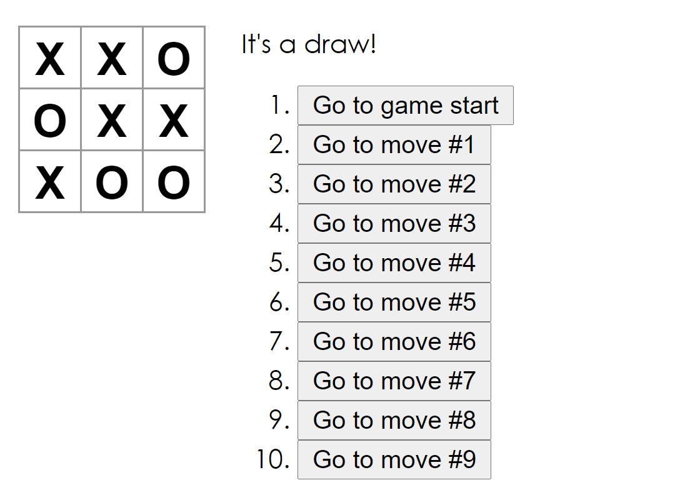

# Introduction

The purpose of this project was to learn React. It was developed with the help of this [Intro to React](https://reactjs.org/tutorial/tutorial.html) tutorial.

## Usage

- Navigate to the project folder: `cd tictactoe`
- Run `npm start`
- Open http://localhost:3000 in the browser
- Play tic-tac-toe

## Result

  

# License

[MIT](https://choosealicense.com/licenses/mit/)